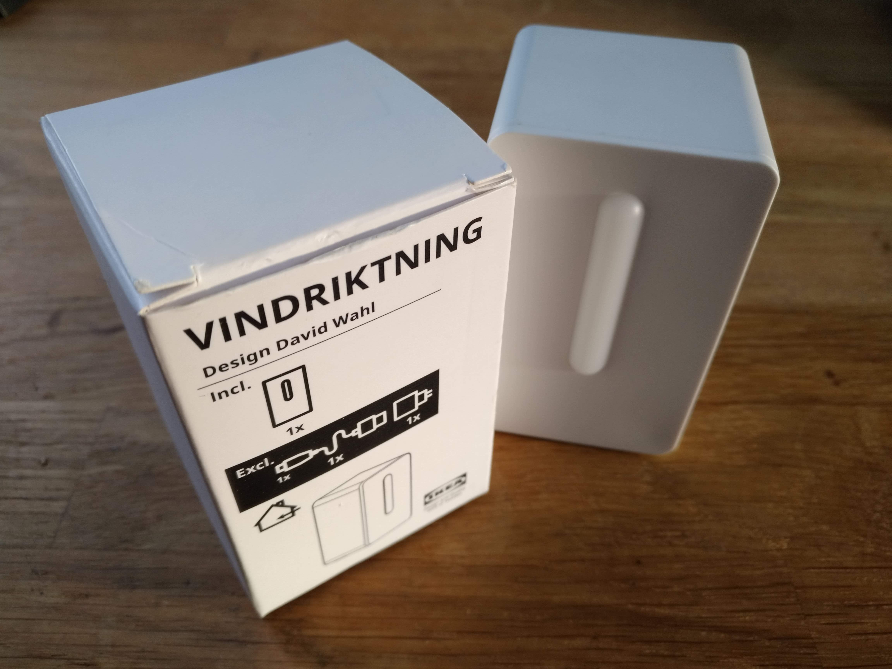
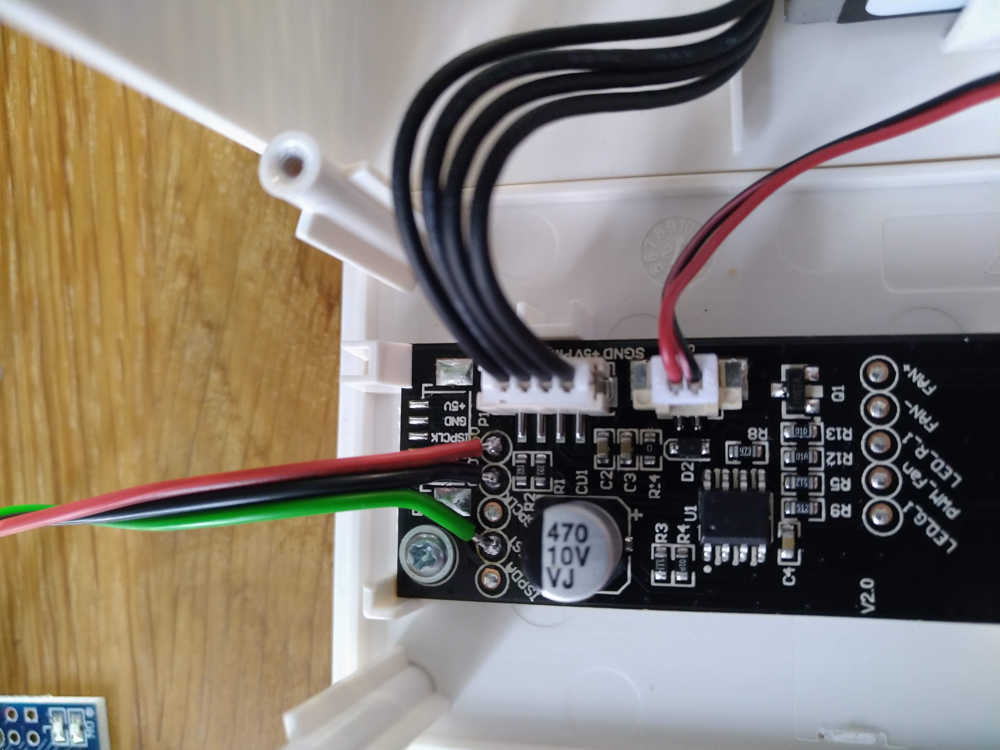
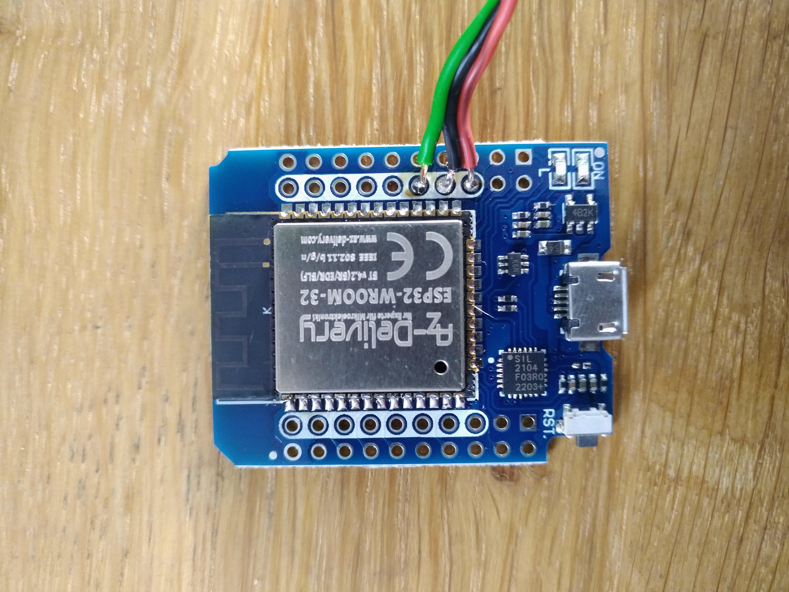
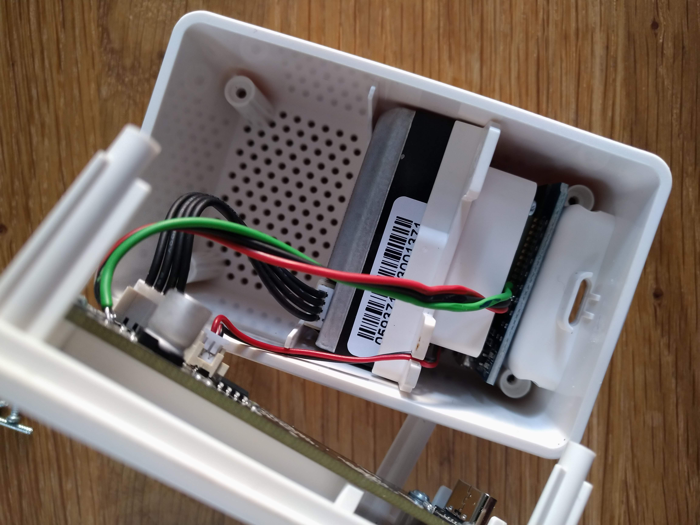

# Vindriktning with Esphome

Let's make the Ikea Vindriktning air quality sensor a little smarter. Here is the matching completely over-engineered firmware.

## prerequisite

ESP32 - S2 mini (any ESP32/ESP8266 would work, but i had these lying around) 
Ikea Vindriktning 
PH0 Philips Screwdriver (long-ish)

# Install

## hardware modification in 4 steps

esp32 -> Vindriktning:  
VCC -> +5V 
GND -> GND 
GPIO17 -> reset 

# Contributors

Every Contribution to this repository is highly welcome! Don't fear to create pull requests which enhance or fix the project, you are going to help everybody.

If you want to donate to the author then you can buy me a coffee.
  

